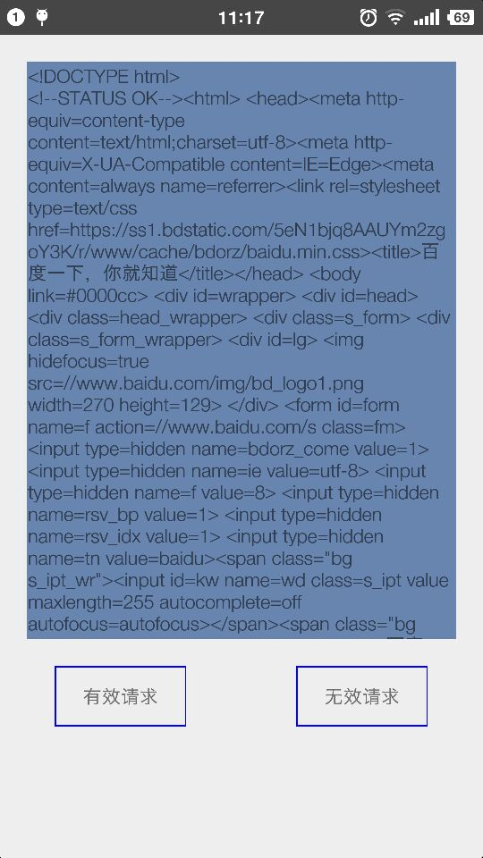

# example-react-flexbox
------
## 这个工程用于介绍从零开始到入门React Native的学习技术栈

#### 工具集及环境

1. [Visual Studio code](https://code.visualstudio.com/)

* 	JS编辑IDE环境
*  安装React, ES6等相关的JS插件
	
2. [Github destop](https://desktop.github.com/)
	
* 	开发及协作方式
	*  [fork -> pull-request](https://segmentfault.com/a/1190000002413519)
* 	需要会使用的内容
	*  create branch
	*  fork 工程
	*  create pull-request 

#### 前端的基本框架(注: 严格按照以下的顺序进行学习及练习)

1. [facebook React的框架](https://facebook.github.io/react/)

	* 关键的技术点
		* React控件的Dom状态(State)和生存周期(lifecycle)
		* React控件的传递参数(props)
		* 理解Immutability Helper这节及与Dom状态的关系
		* Chrome中的Debugger的方式

2. [flexbox的CSS布局](https://css-tricks.com/snippets/css/a-guide-to-flexbox/)

	* 关键的技术点
		* 伸缩布局
		* flex比例
3. [ECMAScript 6入门](http://es6.ruanyifeng.com/)

	* JS的语法
	* 关键技术点
		* 基本的语法 
		* Promise对象
		* 异步操作和async函数

4. Example(First)
	* 需求
		* 基于React+Flexbox+ECMAScript的做一个简单的example
		* step: 
			1. fork当前的工程,新建一个branch: example-react-flexbox
			2. [starter](https://github.com/facebookincubator/create-react-app)工程
			3.  example页面内容
				
				* 按钮分为**有效请求**和**无效请求**, **有效请求**访问http://www.baidu.com, 获取html的内容,展示在文本框中.**无效请求**访问http://www.baiduxxx.com, 获取异步信息展现的广本框中
				* 按钮按下后,需要有个***进度条***,表示正在处于访问网络中
				* 使用异步async, await
				* example可以运行在移动端浏览器(android, ios)和PC web端打开
			4. 完成example后,提交一个pull-request到[当前的库](https://github.com/Caijiacheng/example-react-flexbox/tree/example-blue-react-flexbox)

5. [Redux的框架](https://github.com/reactjs/redux)
	* [中文文档](http://cn.redux.js.org/)
	* 关键技术点
		*  Action + View + Reducer的关系
		*  Action在Chrome中的调试

6. Example(Second)
	* 需求
		* 基于Example(first)的需求,改造成React + Redux的版本 
		* step:
			1. creat branch从: example-react-flexbox,新建一个branch:example-react-redux
			2. 增加redux的框架功能,把页面用Redux实现
			3. 提交一个pull-request到[当前的库](https://github.com/Caijiacheng/example-react-flexbox/tree/example-blue-react-flexbox)

6. [React Native的框架](http://facebook.github.io/react-native/)
	
	* JS的语法
	* 关键的技术点
		* 基本example的跑通(android)
		* 各种控件的使用
		* Chrome上的调试
		* 跳转导航

7. Example(Third)
	* 需求
		* 基于Example(first)的需求,改造成React Native版本 
		* step:
			1. creat branch从: example-react-redux,新建一个branch: example-rn-redux
			2. 使用react-native的技术实现example
			3. 抽象底层android版本的httpclient,替代JS端的http请求接口
			3. 提交一个pull-request到[当前的库](https://github.com/Caijiacheng/example-react-flexbox/tree/example-blue-react-flexbox)

	
	

